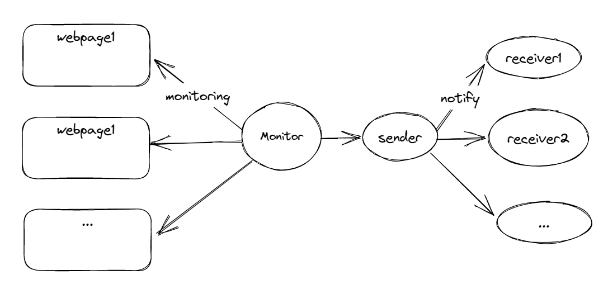

# Webpage Monitor

### Goal

The goal of this script is supporting that one person or a group of people monitor the same webpage(s). So, this script suits for:

- One person want to monitor multiple webpages at the same time.
- A group of people who have the same interests want to monitor the same webpage(s).



### Features

- You can monitor **multiple specified webpage** at the same time.
- You can specify the **interval** of monitoring.
- If the webpages' contents are updated, receiver will get **a notification email**. The notification email contains the changes.
- You can set **sender and receivers** of the notification email.
- You **don't need to restart the script after changing the settings** in any setting file, the running script will automatically apply the new settings.

### Requirement

#### Install Environment and Dependencies

Python@3.10

Download the denpendencies with the following command:

```bash
pip3 install -r requirements.txt
```

#### Setup Settings

Create a `receiver-settings.json` file in the same directory as the script. The file should contain the following (replace the values with your own):

```json
{
    "mailReceiver": "<receiver@mail.com>"
}
```

Create a `sender-settings.json` file in the same directory as the script. The file should contain the following (replace the values with your own):

```json
{
    "mailSender": "<sender@qq.com/foxmail.com>",
    "mailSenderPassword": "<password>"
}
```

**WARNING**: The sender mail **must** be a **qq mail** or **foxmail**, and you can get password de. you can get password depend on the rules that qq mail official website provides. (Maybe support other mail accounts in the future.)

Create a `monitor-settings.json` file in the same directory as the script. The file should contain the following (replace the values with your own):

```json
{
    "webpages": [
        {
            "targetUrl" : "<url1>",
            "intervalToDetect" : 1800
        },
        {
            "targetUrl" : "<url2>",
            "intervalToDetect" : 1800
        }
    ]
}
```

- `webpages`: the list of webpages you want to monitor
- `targetUrl`: the url of the webpage you want to monitor
- `intervalToDetect`: the interval to detect the change of the webpage, in `seconds`

**TIP**: It's recommended that set the interval **between 15 minutes and 90 minutes**. On one hand, the script will send a notification email to you if the webpages are updated. If you set the interval to be too short, you will receive too many emails. On the other hand, the script would restart every 90 minutes to load the monitor settings, it's meaningless to set the interval to be too long.

---

You can also run the script to generate settings files above (But it's **not** recommended to do so when you **first** use the script, because there are some essential messages you need to read):

```bash
bash init.sh
```

### Usage

After the settings are done, run the script with the following command:

```bash
python3 monitor.py
```

If you want to run the script in the **background** (in server), you can use `nohup`:

```bash
nohup python3 monitor.py &
```

View the running status of the script:

```bash
ps aux | grep monitor.py

# output example:
# USER PID ...  18:10   0:00 python3 WebsiteMonitor.py
```

And you can kill the script with the following command:

```bash
kill -9 <PID>
```

If you want to change settings (either monitor settings or email settings), enjoy your freedom to change the settings in the corresponding setting files and go ahead do your work. The script will automatically apply the settings without restarting. 

### TODO

- [x] If target webpage is changed in `monitor-settings.json`, the script should take notice of it and apply it.
- [x] Support monitor multiple webpages at the same time
- [ ] Support more mail accounts of sender
